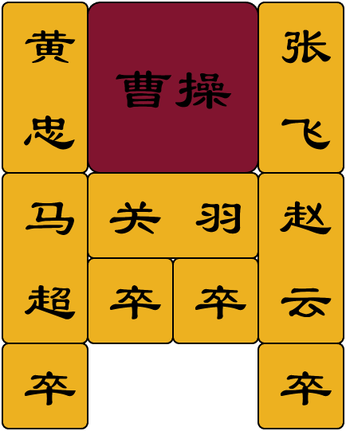
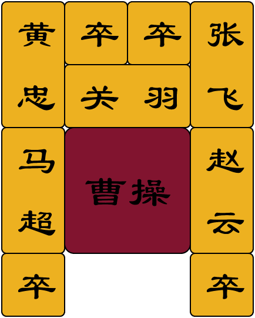

# huarongdao-AI-matlab
Huarongdao game and AI written in matlab code.

Support human play mode, Breadth First Search (BFS) mode and Depth First Search (DFS) mode. 
The initial placement position can be automatically generated for rollout or manually designed.

A more detailed document, including explanations of code structure and function abilities, can be found in `huarongdao/readme.txt`.



## Quick Start
```
git clone https://github.com/PuzhenYuan/huarongdao-AI-matlab.git
cd huarongdao
matlab start.m # or run in a matlab code editor
```
